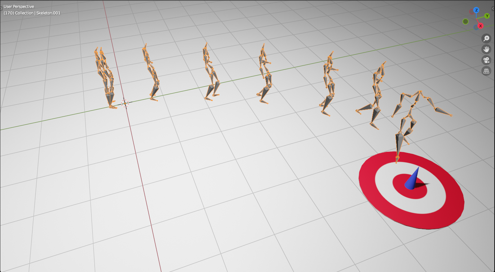

# myProject

An reinforcement learning extension built on HuMoR model. 



Model structure


This repo contains the code used in the project. The repo should be placed under the HuMoR repo folder. 
The environment is also build on HuMoR environment. 
Required packages are in requirements-rl.txt. 
```
pip install -r requirements-rl.txt
```

a test time sample run:
```
humor.sh
```
